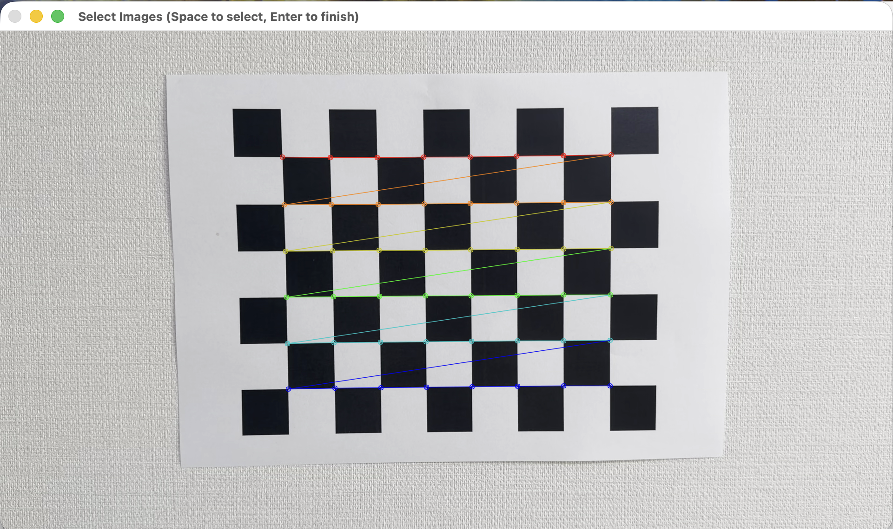

# Lens Distortion Correction using OpenCV

## Description
This project performs camera calibration and lens distortion correction using OpenCV. A chessboard pattern is used to estimate camera parameters, and the results are applied to correct distortion in a video.

The goal is to make curved lines in a distorted video appear straight after calibration and rectification.

---

## Main Idea
1. Select useful frames from a video containing a chessboard pattern  
2. Detect chessboard corners and compute camera parameters  
3. Apply the calibration result to correct distortion in the video  

---

## Features
- Frame selection from video for calibration  
- Automatic chessboard corner detection  
- Camera calibration using OpenCV  
- Distortion correction using calibration results  
- Toggle between original and rectified video  
- Save calibration results for reuse  

---

## Project Structure

- camera_calibration.py : Select frames and compute camera parameters  
- distortion_correction.py : Apply distortion correction to video  
- calibration_result.npz : Saved camera matrix and distortion coefficients  
- mtx.npy : Camera matrix (alternative saved format)  
- dist.npy : Distortion coefficients (alternative saved format)  
- chessboard.mp4 : Input video for calibration/testing  
- rectified_output.mp4 : Output corrected video  

---

## Calibration Data

### Camera Matrix (K)

[[1647.1731, 0, 944.7729],
[0, 1646.8841, 544.6419],
[0, 0, 1]]

### Distortion Coefficients

[0.0047193, 4.1059985, -0.0019868, -0.0027954, -27.1599164]

These values represent:
- Camera intrinsic parameters (focal length, optical center)
- Lens distortion effects

They are used to remove distortion from the video frames.

---

## Calibration Result Screenshot

---

## Demo Results

  <b>Original Video</b> 
  <video width="450" controls>
    <source src="chessboard.mp4" type="video/mp4">
    Your browser does not support the video tag.
  </video>

  <b>Rectified Video</b> 
  <video width="450" controls>
    <source src="rectified_output.mp4" type="video/mp4">
    Your browser does not support the video tag.
  </video>

---

## Controls
- `Space` : Select frame during calibration  
- `Enter` : Finish selection  
- `R` : Toggle original / rectified view  
- `Q` : Quit  

---

## Notes
- Better results are achieved with more calibration frames  
- Different angles of the chessboard improve accuracy  
- Distortion is more visible near image edges  

---

## Requirements
- Python 3  
- OpenCV (`cv2`)  
- NumPy  

Install:

pip install opencv-python numpy
